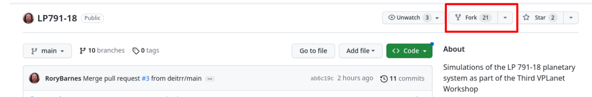
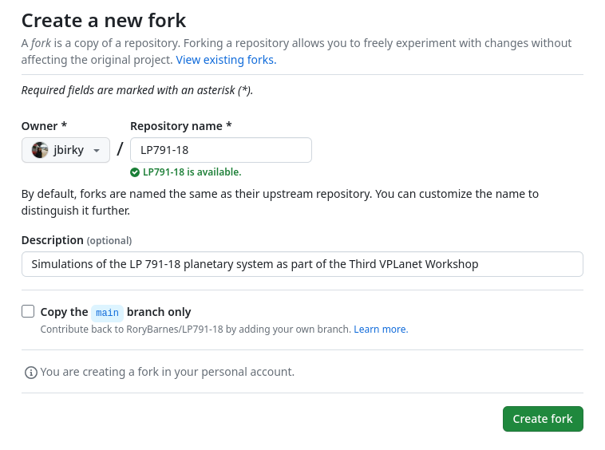

## Preliminary items

**Setting up VPLANET**

If you have not yet installed VPLANET, you’ll want to run:
 ```
pip install vplanet
```
If you have attempted to pip install VPLANET and run into issues, try installing from source: 
```
git clone https://github.com/VirtualPlanetaryLaboratory/vplanet 
cd vplanet
python setup.py –-install
```
If you have attempted to clone from source and run into issues:
see Rory for tech support in the main room

If you have successfully installed VPLANET (and can run `import vplanet` in python):
You’re all set for this session! 

**Additional dependencies:** You'll also want to install the following Python packages (using your `pip` or `conda` package manager):
```
numpy
matplotlib
tqdm
astropy
```

## Setting up the Project Repository

1. Go to https://github.com/RoryBarnes/LP791-18



2. Fork the most recent version of the code (make sure to unselect copy on main branch)



3. On your local machine in a desired directory, clone the repo that you just forked
```
git clone https://github.com/jbirky/LP791-18.git 
cd LP791-18
```

4. In your forked repository, create a new branch called `<GroupnameLastnameFirstname>`, e.g., 
```
git checkout -b StellarBirkyJessica
```

5. Now we'll copy the tutorial files for our project group and create a new local folder to store our results. In the repository, go to your group's directory, e.g., Rotation, and create a directory called `<LastnameFirstname>`, e.g.
```
cd Stellar
mkdir BirkyJessica
cp run_stellar.ipynb BirkyJessica
```

6. Launch jupyter notebook and navigate to `LP890-9/Stellar/<LastnameFirstname>/run_stellar.ipynb`

## Uploading Results to Github

1. We will make all of our commits to the branch that we created, `<GroupnameLastnameFirstname>`

2. After you've made code modifications / have simulations to upload, add and commit them to git 
```
	git add Stellar/<LastnameFirstname>/run_stellar.ipynb
	git add Stellar/<LastnameFirstname>/simulations.npz
	git commit -m "upload results"
	git push origin StellarBirkyJessica
```
Add any other results you want to contribute, but make sure not to upload files more than 100MB! 

3. On github, navigate back to your forked branch https://github.com/jbirky/LP791-18 (this will be under your own username). At the top of the repo click `contribute` to create a pull request. One of the admins will then merge your contributions to the main repository.


